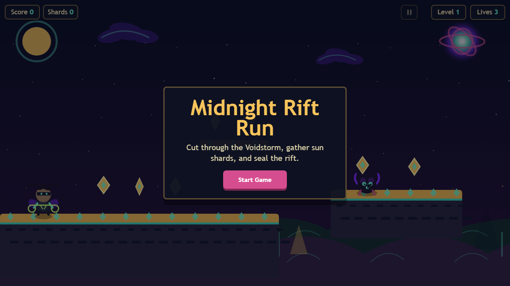

# Midnight Rift Run


Midnight Rift Run is a browser-based 2D platformer built with vanilla JavaScript and HTML5 Canvas. It focuses on tight player controls, responsive camera movement, hand-drawn procedural canvas art, and a complete static frontend that runs without a backend, package install, or build step.

<p align="center">
  
</p>

## Why This Project Exists

This project is a compact portfolio piece that shows practical frontend engineering without hiding behind a framework. The code is split into focused modules for game state, entities, rendering, input, audio, particles, and level data, so the mechanics can be reviewed quickly.

## Features

- Three handcrafted levels with increasing platforming difficulty
- Player movement with acceleration, friction, coyote time, jump buffering, and double jump
- Smooth camera tracking with dead zones and direction-aware look-ahead
- Coins, checkpoints, enemies, lives, scoring, pause flow, game-over flow, and win state
- Keyboard controls plus responsive touch controls for mobile devices
- Procedural Canvas rendering for the player, enemies, platforms, effects, and background
- Lightweight Web Audio sound effects generated in the browser
- No external runtime dependencies and no stored user data

## Engineering Highlights

- **Data-driven level design:** `frontend/js/levels.js` stores level layouts as plain objects, keeping gameplay logic separate from content tuning.
- **Forgiving platformer controls:** `frontend/js/entities.js` implements coyote time and jump buffering to make jumps feel deliberate instead of brittle.
- **Frame-rate-aware camera:** `frontend/js/game.js` uses exponential smoothing so camera motion stays stable across different machines.
- **Transient input handling:** `frontend/js/input.js` consumes one-shot events such as jump, pause, and menu action instead of retriggering them every frame.
- **Canvas-first rendering:** `frontend/js/renderer.js` draws the full scene with code-native assets, which keeps the project portable and easy to inspect.

## Run Locally

Open the game directly in a browser:

```text
frontend/index.html
```

Or serve the repository root with any static server and open the root page. The root `index.html` redirects to the game and is ready for GitHub Pages.

## Controls

| Action | Keyboard | Touch |
| --- | --- | --- |
| Move | `A` / `D` or arrow keys | Left / right buttons |
| Jump | `Space` | Jump button |
| Double jump | `Space` while airborne | Jump button while airborne |
| Pause | `P`, `Escape`, or pause button | Pause button |

## Project Structure

```text
.
|-- index.html                  # GitHub Pages-friendly redirect to the game
|-- frontend/
|   |-- index.html              # Game shell and script loading order
|   |-- css/styles.css          # Layout, HUD, menu, and touch controls
|   `-- js/
|       |-- config.js           # Shared constants and helpers
|       |-- audio.js            # Web Audio sound effects
|       |-- input.js            # Keyboard and touch input
|       |-- levels.js           # Level definitions
|       |-- particles.js        # Particle effects
|       |-- entities.js         # Player, enemies, collectibles, checkpoints
|       |-- renderer.js         # Canvas drawing code
|       `-- game.js             # Game loop, state, camera, scoring, progression
|-- backend/                    # Reserved for future server/API work
|-- docs/                       # Portfolio screenshots and supporting assets
`-- .github/                    # Issue and pull request templates
```

## Security And Privacy

The game is a static frontend demo. It does not require API keys, authentication, analytics, a database, cookies, or environment variables. Local-only files such as `.env`, `.env.*`, `.idea/`, build output, and dependency folders are ignored.

## Roadmap

- Publish a live GitHub Pages demo
- Add optional high-score persistence with local storage
- Add a level-select screen after the first full clear
- Add a small automated smoke test for the main HTML entry point
- Expand the level data into a lightweight level editor

## Status

The current version is complete enough to play through from start to finish and intentionally small enough for code review.
